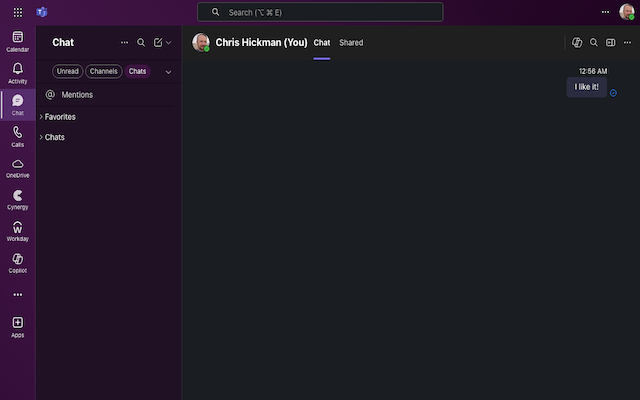

  
# Themes for Teams - Chrome, Firefox and Edge Extension

I work for a company that recently migrated to Teams.  

I decided to build a Chrome Extension to customize it to
suit my purposes.  It works with Firefox too!

## Features

- Reduction in unnecessary padding around elements
- Font Selection
- Themes Selection
- Moves Post Titles beside avatar - much nicer!
- Subtle style changes to give Teams an edge!

## Chrome Installation

1. Visit: chrome://extensions/
2. Enable Developer Mode (top right!)
3. Click 'Load Unpacked'
4. Select the folder you unzipped this to that contains manifest.json
5. Reclaim your wasted screen real estate!

## Firefox Installation

1. Visit: about:debugging
2. Click 'This Firefox' on the left.
3. 'Load Temporary Add-On'.
4. Select the manifest.json from this repo.
5. Extension will not persist (working on submitting)

## Changelog

v0.1.4
   - Handles long titles with full width, no wrap, ellipses ...
   - Font Smoothing

v0.1.1 
  - Fixed click target area on replies for emojis

v0.1.0 - Beta
  - Gradient UI borders, more tweaks, better themes.  Supports Firefox.

v0.0.1 - Alpha
  - Widened Chats, Channels, Reduced Team/Channel List gutter and set default font to Lato

