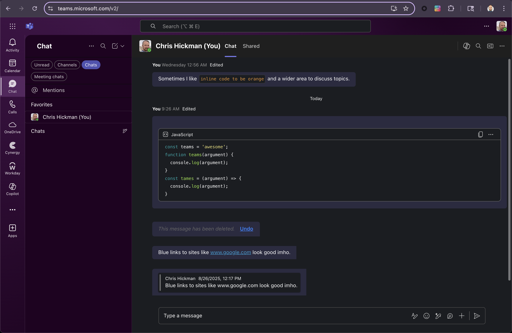

  
# Themes for Teams - Chrome, Firefox and Edge Extension

I work for a company that recently migrated to Teams.  

I decided to build a browser extension to improve the overall experience and make Teams feel like home.

## Features

- Themes Selection
- Font Selection
- Reduction in unnecessary padding around elements
- Moves Post Titles beside avatar - much nicer!
- Remove the 'expand/collapse' behavior on messages and filters
- Subtle style changes to give Teams an edge!

## Chrome Installation

[Install from the Chrome Web Store](https://chromewebstore.google.com/detail/themes-for-teams/odimdoddkdpnifojkpgcmcgehlkdjakj)

Or Manually Install:

1. Visit: chrome://extensions/
2. Enable Developer Mode (top right!)
3. Click 'Load Unpacked'
4. Select the folder you unzipped this to that contains manifest.json
5. Reclaim your wasted screen real estate!

## Firefox Installation

[Install from Firefox Browser Add-Ons](https://addons.mozilla.org/en-US/firefox/addon/themes-for-teams/)

Or Manually Install:

1. Visit: about:debugging
2. Click 'This Firefox' on the left.
3. 'Load Temporary Add-On'.
4. Select the manifest.json from this repo.
5. Extension will not persist (working on submitting)

## Changelog

v0.3.6
  - Removed padding on sides of channels again (compatible with Threads)

v0.3.5
  - Fixes many spacing issues caused by Threads update
  - New Extension Icon
  - Themed Theme Selector
  - Subtle border around images - fixes 'weirdness' if image has blank pixels above/below

v0.3.4
  - Automatically show 'Meeting Chats' filter in left column
  - Remove filters 'expand' icon (no longer needed)
  - Automatically expand posts, remove See More / See Less
  - Message replies - added 3px left blue border to visually tie replies to message.
  - Embedded Content - Smaller footer text, small rounded border, removed left blue border
  - Default code block text color -> white (inline code remains orange)

v0.3.3
  - Set code font to 85% size.
  - Improved TypeScript / JavaScript Codeblock colors
  - Improved avatar/name/timestamp in chats.
  - Subtle transparency on notification overlays
  - Prefix -your- chat messages with 'You' (left aligned)

v0.3.2
  - Deeper "Purple" Theme
  - Orange Code Blocks
  - Fixes Comic Sans (by popular request)

v0.3.1
  - Fixes channel reply width

v0.3.0 
  - Simplified themes to color values to use with base theme.
  - Added more themes!
  - Avatars are now rounded squares, not circles.

v0.2.0
  - Supports Light Mode!

v0.1.4
  - Handles long titles with full width, no wrap, ellipses ...
  - Font Smoothing

v0.1.1 
  - Fixed click target area on replies for emojis

v0.1.0 - Beta
  - Gradient UI borders, more tweaks, better themes.  Supports Firefox.

v0.0.1 - Alpha
  - Widened Chats, Channels, Reduced Team/Channel List gutter and set default font to Lato

